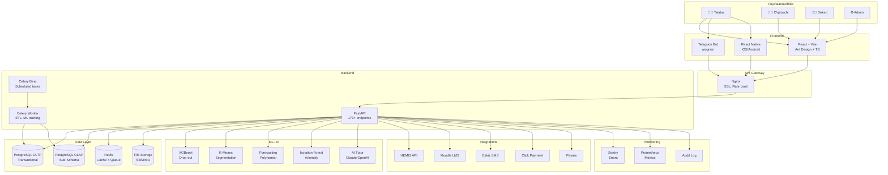
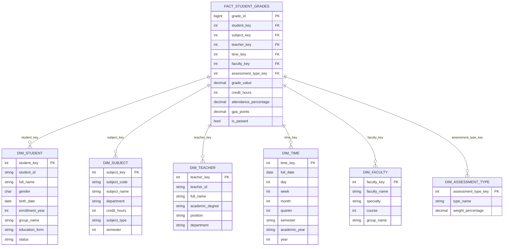
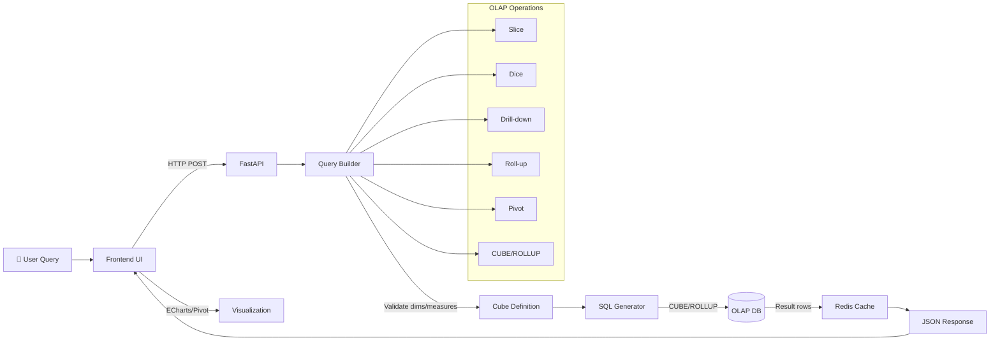
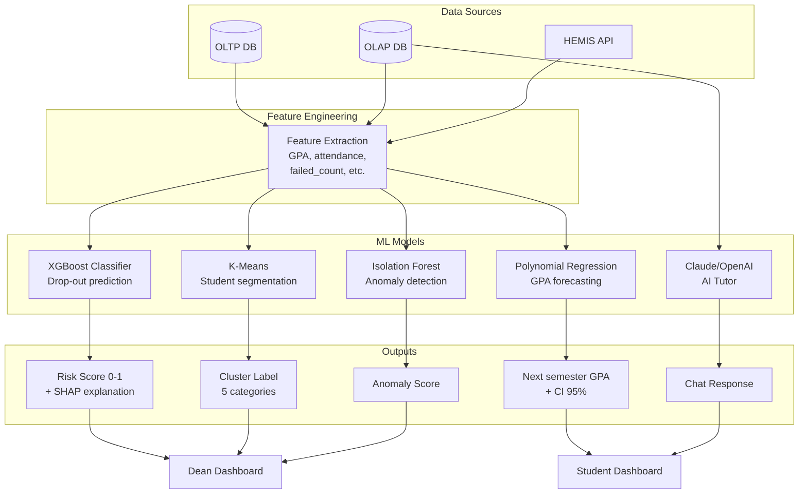
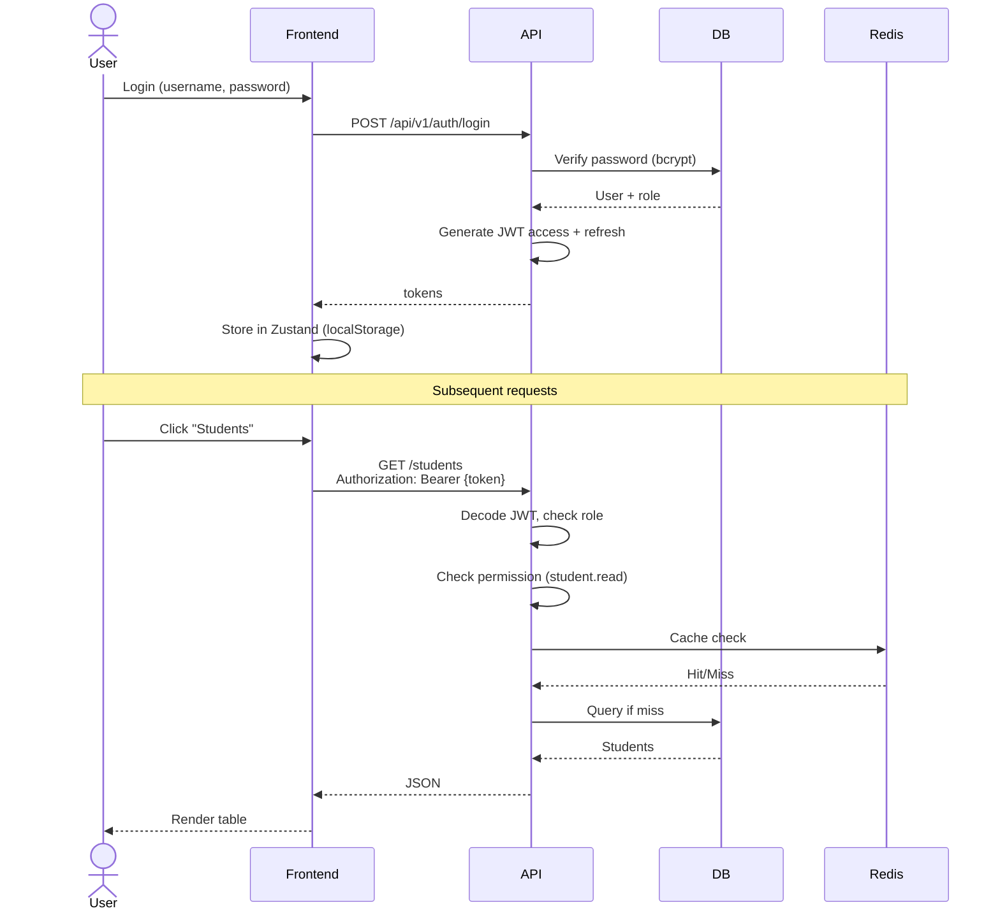
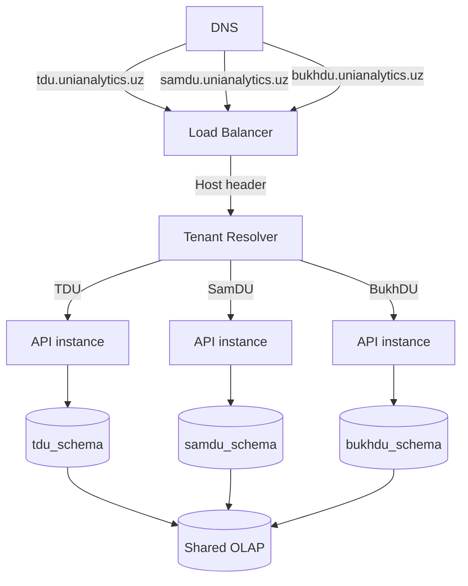
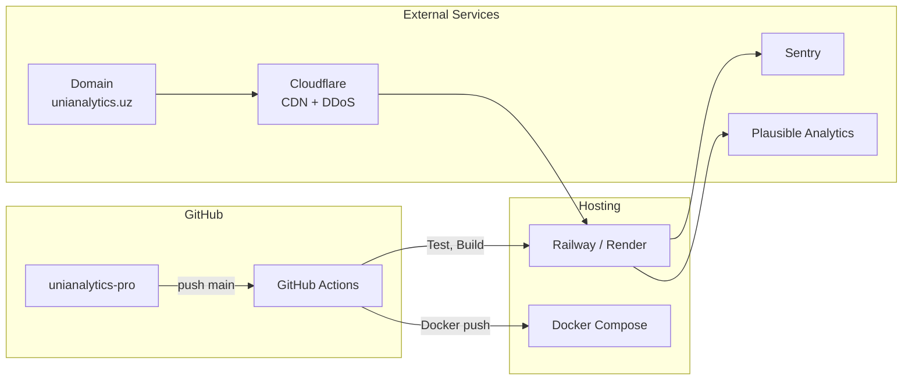
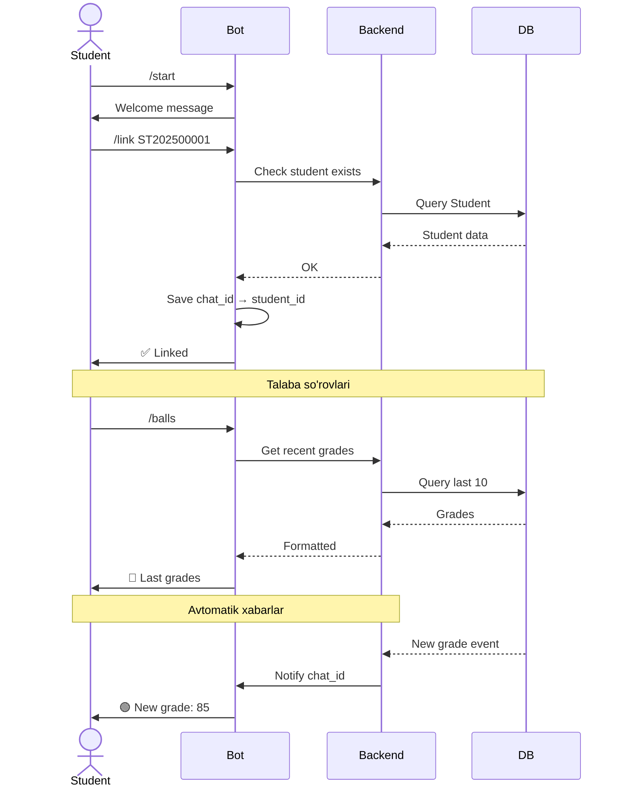

# 🏗️ UniAnalytics PRO — Architecture

## System Overview

---

## Star Schema (OLAP)

---

## OLAP Operations Flow

---

## ML Pipeline

---

## Authentication & Authorization Flow

---

## Multi-Tenant Architecture

---

## Deployment Architecture

---

## Telegram Bot Integration

